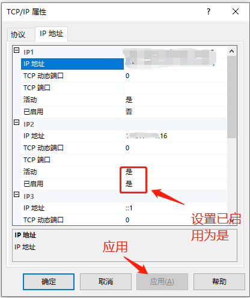
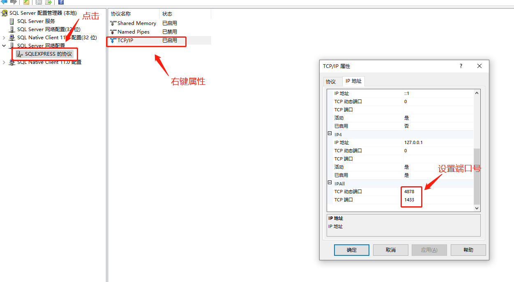
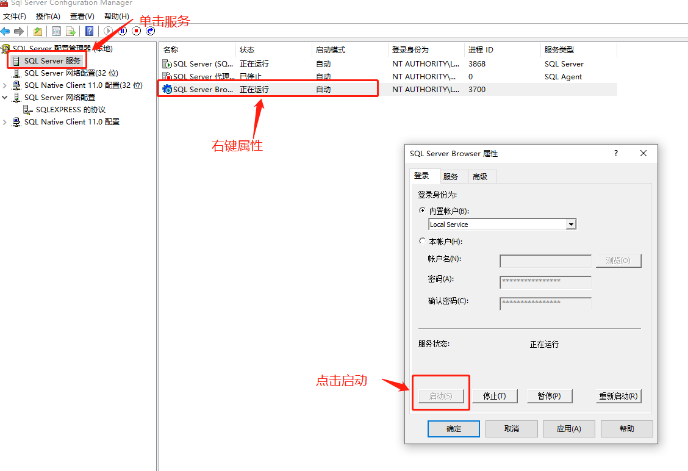
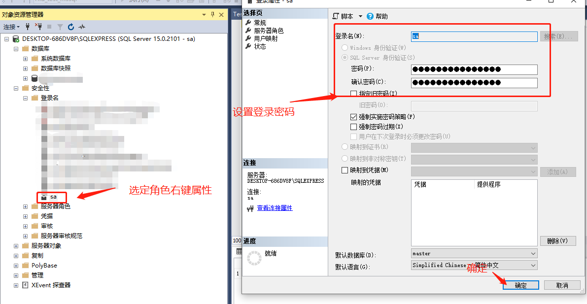
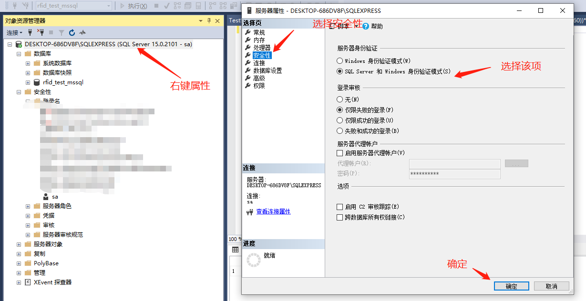

# SQLServer 食用指南

[TOC]

## 1. 环境部署

### 1.1. 软件包安装

### 1.2. 配置开启远程连接

- 打开 SSMS
  
  
  
  
  
  

- 打开 SSCM
  
  
  
  

- 打开防火墙设置对应端口规则

## 2. 常用SQL

### 2.1. 表控制

#### 2.1.1. 创建表设置自增 id

```sql
CREATE TABLE table_name (
    id BIGINT PRIMARY KEY IDENTITY(1, 1) NOT NULL
)
```

#### 2.1.2. 修改表

```sql
-- 删除列
ALTER TABLE table_name 
DROP COLUMN id;
-- 设置列自增 id
ALTER TABLE table_name  
ADD Id BIGINT 
IDENTITY(1, 1) NOT NULL;
```

#### 2.1.3. 清除表单数据

```sql
-- 重置表数据
TRUNCATE TABLE table_name;
```

#### 2.1.4. 删除表

```sql
DROP TABLE table_name;
```

#### 2.1.5 声明表变量

```sql
CREATE TYPE table_name AS TABLE (
    var1 NVARCHAR(200) NULL, 
    var2 NVARCHAR(200) NULL
)
```

#### 2.1.6 表类型使用

```sql
-- 表类型操作
-- 当不存在表类型时创建表类型        
IF TYPE_ID(N'dbo.table_type') IS NULL
BEGIN
    -- 表类型存在，执行相应的操作
    CREATE TYPE [dbo].[table_type] AS TABLE (
        tableVar1 INT NULL, 
        tableVar2 INT NULL
    );
END
-- 删除表类型
DROP TYPE dbo.table_type; 

-- 使用表类型
DECLARE @table table_type
```

### 2.2. SQL 编程

#### 2.2.1. 存储过程

1. 创建存储过程

```sql
CREATE PROCEDURE [dbo].[procedure_name]
@var1 NVARCHAR(50) INPUT,
@var2 INT OUTPUT

AS
BEGIN
  DECLARE @var3 INT 
  DECLARE @table_var TABLE (
    id INT NULL,
    col INT NULL
)

  SET @var3 = 0
  -- DOSOMETHING 

  IF @var3 IS NULL 
    BEGIN
      RETURN 0
    END
  ELSE 
    BEGIN 
      RETURN @Sequence
   END
END
```

2. 表类型的表变量在存储过程中的使用方式
   
   ```sql
   -- 表类型操作
   -- 当不存在表类型时创建表类型        
   IF TYPE_ID(N'dbo.table_type') IS NULL
   BEGIN
       -- 表类型存在，执行相应的操作
       CREATE TYPE [dbo].[table_type] AS TABLE (
           tableVar1 INT NULL, 
           tableVar2 INT NULL
       );
   END
   -- 删除表类型
   DROP TYPE dbo.table_type; 
   
   -- 表类型使用
   CREATE PROCEDURE [dbo].[procedure_name]
   @var1 NVARCHAR(50) INPUT,
   @varTable AS table_type READONLY
   AS
   BEGIN
     DECLARE @var3 INT
   
     SET @var3 = 0
    -- DOSOMETHING 
   
     IF @var3 IS NULL 
     BEGIN
       RETURN 0
     END
     ELSE 
     BEGIN 
       RETURN @Sequence
     END
   END
   ```

#### 2.2.2. 函数

```sql
CREATE FUNCTION [dbo].[function_name]
( 
@var1 INT,
@var2 INT
)
RETURNS NVARCHAR(300) -- 返回值
AS
BEGIN
 DECLARE @Result NVARCHAR(300)

 -- DOSOMETHING

 RETURN @Result
END
```

#### 2.2.3. 事务

1. 事务使用
   
   ```sql
   -- 示例
   BEGIN TRANSACTION 
   SAVE TRANSACTION transactionName
   -- dosomething
   COMMIT TRANSACTION transactionName;
   ROLLBACK TRANSACTION transactionName;
   ```

2. 在存储过程中使用事务
   
   ```sql
   -- 声明事务控制变量
   DECLARE @ExistTrancount INT
   -- 事务控制变量赋值
   SELECT @ExistTrancount = @@trancount    
   -- 若当前已存在事务 (事务传递) 则保存当前事务信息，否则创建新事务
   IF @ExistTrancount > 0 
       SAVE TRANSACTION TranProc
   ELSE    
       BEGIN TRANSACTION 
   
   -- dosomething
   
   IF @@error <> 0
   GOTO ERROR
   
   -- 若当前事务无异常则提交事务
   IF @ExistTrancount = 0
       COMMIT TRANSACTION TranProc
   
   -- 事务回滚逻辑
   ERROR: 
       ROLLBACK TRANSACTION TranProc
   ```

### 2.3. 变量使用

- 子查询返回的值多于一个。当子查询跟随在=、!=、<、<=、>、>= 之后，或子查询用作表达式时，这种情况是不被允许的。

```sql
CREATE TABLE table1( 
userid INT , 
addr VARCHAR(128)  
) 
GO 
INSERT INTO table1(userid, addr) VALUES(1, 'addr1') 
INSERT INTO table1(userid, addr) VALUES(2, 'addr2') 
INSERT INTO table1(userid, addr) VALUES(3, 'addr3') 
GO

DECLARE @addr varchar(128)
-- 报错
SET @addr = (SELECT addr FROM table1)
```

- 表达式返回多个值时，使用 SELECT 赋值 ，返回结果集最后一个 addr 列的值
  
  ```sql
  DECLARE @addr VARCHAR(128)
  SELECT @addr = addr FROM table1 
  PRINT @addr -- 结果集最后一个值
  ```

- 表达式未返回值时，使用 SET 赋值 ，返回结果为 NULL
  
  ```sql
  SET @addr = '初始值'
  SET @addr = (SELECT addr FROM table1 WHERE userid = 4 ) -- 返回 NULL
  ```

- 表达式未返回值时，使用 SELECT 赋值，返回值为原值
  
  ```sql
  SET @addr = '初始值'
  SELECT @addr = addr FROM table1 WHERE userid = 4 -- 返回原值
  ```

- 需要注意的是，SELECT 也可以将标量子查询的值赋给变量，如果标量子查询不返回值，则变量被置为 NULL 值。   此时与使用 SET 赋值是完全相同的。

### 2.4. 常用函数

#### 2.4.1. PIVOT() 函数

说明：可以使用 `PIVOT` 和 `UNPIVOT` 关系运算符将表值表达式更改为另一个表。 `PIVOT` 通过将表达式中的一个列的唯一值转换为输出中的多列，来轮替表值表达式。 `PIVOT` 在需要对最终输出所需的所有剩余列值执行聚合时运行聚合。 与 PIVOT 执行的操作相反，`UNPIVOT` 将表值表达式的列轮换为列值。

```sql
-- 使用方法
SELECT <non-pivoted column>,  
    [first pivoted column] AS <column name>,  
    [second pivoted column] AS <column name>,  
    ...  
    [last pivoted column] AS <column name>  
FROM  
    (<SELECT query that produces the data>)   
    AS <alias for the source query>  
PIVOT  
(  
    <aggregation function>(<column being aggregated>)  
FOR   
[<column that contains the values that will become column headers>]   
    IN ( [first pivoted column], [second pivoted column],  
    ... [last pivoted column])  
) AS <alias for the pivot table>  
<optional ORDER BY clause>;  
```

#### 2.4.2. WAITFOR() 函数

示例：

```sql
-- 延时执行
WAITFOR DELAY 'hh:mm:ss'
PRINT 'hello'
-- 定时执行
WAITFOR TIME 'hh:mm:ss'
PRINT 'hello'
```

#### 2.4.3. ISNULL() 函数

说明：判断指定值 `value` 为 NULL 时替换为特定值 `instandValue` 。

注意：当 SQL 中使用 `GROUP BY` 时，`SELECT` 选中多个列显示时该函数会失效。（具体情况待排查）

示例：

```sql
ISNULL(value, instandValue)
```

#### 2.4.4. STUFF() 函数

说明：删除指定长度的字符，并在指定的起点处插入另一组字符。

Str1：一个字符数据表达式。

start：整型，指定删除和插入的开始位置。若 start 为负，则返回空字符串。若 start 比 Str1 长度的值大，则返回空字符串。

length：整型，指定删除的字符数。若 length 比 Str1 长度的值大则删除到 Str1 最后一个字符。

```sql
STUFF(Str1, start, length, Str2)
```

#### 2.4.5. FOR XML PATH() 函数

#### 2.4.6. CONVERT() 函数 与 TRY_CONVERT() 函数

`CONVERT()` 函数说明：`CONVERT()` 函数是 SQLServer 中的类型转换函数

其中：

      `datatype`表示转换后的数据类型，例如`DATETIME` 、`VARCHAR` 、`INT`

      `expression` 表示转换的表达式。

      `style` 是可选的，表示转换后的格式。

```sql
CONVERT(datatype, expression [, style])
```

示例：

```sql
# datetime2 转 nvarchar 格式为'YYYY-mm-DD hh:MM:ss'
CONVERT(nvarchar(19), datecol, 120)

# 获取当天时间
BETWEEN CONVERT(date, GETDATE())
AND CONVERT(date, DATEADD(DAY, 1, GETDATE()))
```

`TRY_CONVERT()` 函数说明: 执行时会先判断是否可以转换为指定类型，若可以转换则返回转换值，否则返回 `NULL`

示例：

```sql
TRY_CONVERT(INT, '0xff') -- 返回 NULL
TRY_CONVERT(INT, 'abc')  -- 返回 NULL
TRY_CONVERT(INT, '123')  -- 返回 123
```

#### 2.4.7. GETDATE() 函数

获取当前时间

```sql
GETDATE()
```

#### 2.4.8. ISNUMERIC() 函数

```sql
-- 判断传出参数是否为数字，如果是则返回 1 ,否则返回 0
DECLARE @val NVARCHAR(20) = 'a' -- 返回 0
SET @val = '123' -- 返回 1
SET @val = '0xffffff' -- 返回 1
DECLARE @num INT = 123 -- 返回 0

ISNUMERIC(@val)
```

#### 2.4.9. CAST() 与 TRY_CAST() 函数

`CAST()` 函数说明: 类型转换为指定类型

示例：

```sql
CAST(val AS VARCHAR)
```

`TRY_CAST()` 函数说明: 类型转换前先判定能否转换，若可以转换则返回转换值，若不可以转换则返回 `NULL`

示例：

```sql
TRY_CAST('123' AS INT) -- 返回 123
TRY_CAST('ABC' AS VARCHAR) -- 返回 NULL
TRY_CAST('0xFF' AS VARCHAR) -- 返回 NULL
```

#### 2.4.10. COALESCE() 函数

说明：判断值是否为 N/A 

示例：

```sql
COALESCE(value, res)    -- 判断当前值 value 是否为 N/A 当为空时返回 res
```

#### 2.4.11 OPENQUERY() 函数

说明：使用 `OPENQUERY()` 函数，在 MSSM 里面设置远程连接数据库服务器后，可以实现跨服务器远程访问。

示例：

```sql
-- 基本用法
OPENQUERY(link_name, sql)

-- 查询
SELECT * FROM OPENQUERY(link_name, sql)

-- 动态查询
DECLARE @exec_query NVARCHAR(MAX) = 
'SELECT * FROM OPENQUERY(link_name, SELECT * FROM link_table_name WHERE id = ''' + 
CAST(id AS VARCHAR(50)) + ''')'
EXEC(@exec_query)

-- 插入操作
INSERT INTO OPENQUERY(link_name, 
    SELECT val1, val2, val3 FROM link_table_name
) VALUES (val1, val2, val3,)

-- 更新操作
UPDATE OPENQUERY(link_name, 'SELECT val1 FROM link_table_name') 
SET val1 = 'val1'

-- 删除操作
DELETE OPENQUERY(link_name, 'SELECT val1 FROM link_table_name') 
WHERE val1  IN (1,3)
```

**注意：** 无法在触发器里使用，若在触发器中使用会报如下错误。

> [42000] [Microsoft][SQL Server Native Client 11.0][SQL Server]无法执行该操作，因为链接服务器 "mysql_7024" 的 OLE DB 访问接口 "MSDASQL" 无法启动分布式事务。 (7391)
> [01000] [Microsoft][SQL Server Native Client 11.0][SQL Server]链接服务器"mysql_7024"的 OLE DB 访问接口 "MSDASQL" 返回了消息 "[MySQL][ODBC 8.0(w) Driver]Optional feature not supported"。 (7412)`

### 2.5. 库控制

#### 2.5.1. 设置数据库 UTF-8 编码

```sql
-- 示例
CREATE DATABASE databasename COLLATE Chinese_PRC_CI_AS
GO
ALTER DATABASE databasename COLLATE Chinese_PRC_CI_AS
GO
```

#### 2.5.2. 设置表的自增值

```sql
-- 查询当前自增数
DBCC checkident([table_name], NORESEED);
-- 更新当前自增数为指定值
DBCC checkident([table_name], RESEED, 1);


```

### 2.6. SQL 高级用法

#### 2.6.1. ORDER BY 分页

说明：分页使用必须在 `ORDER BY` 里面使用；

            `OFFSET` 项后面设置跳过的页数。

            `FETCH NEXT` 项后面设置每页显示的行数。

```sql
-- 示例
SELECT *
FROM table t
-- 说明： 必须带有 ORDER BY 列名 X 为 offset 偏移位即跳过前 X 页， Y 为页显示行数
ORDER BY col 
OFFSET x ROWS 
FETCH NEXT Y ROWS ONLY
```

### 2.7. 触发器

#### 2.7.1. DML 触发器

说明：触发器是一个特殊的存储过程，同一个表的同一个操作可以定义多个触发器。

示例：

```sql
CREATE TRIGGER trigger_name
FROM table_name
FOR | AFTER | INSTEAD OF | [INSERT, DELETE, UPDATE] -- 监控表的操作
AS 
BEGIN
    -- 获取插入数据
    SELECT * 
    FROM inserted
    -- 获取删除数据
    SELECT *
    FROM deleted

    SELECT * 
    FROM updated
    -- do something
END
```

## 3. 并发操作

### 3.1. 锁

#### 3.1.1. 锁类型

- 意向锁：
  
  - IS：
  
  - IX：

- 共享锁
  
  - S:

- 排他锁
  
  - X:

#### 3.1.2. 锁粒度

- 表锁: 

- 行锁: 

#### 3.1.3. 锁操作
